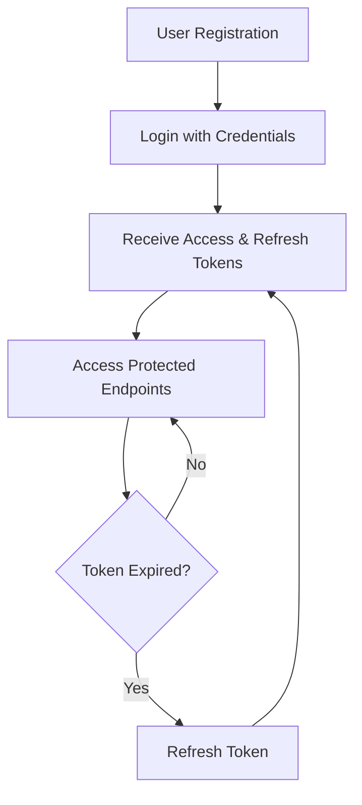

# Ecommerce API Overview

## Introduction

The Ecommerce API is a comprehensive RESTful service designed to power modern online shopping experiences. Built with scalability and security in mind, it provides endpoints for managing products, user authentication, shopping carts, orders, and product images.

## Key Features

### 🛍️ **Product Management**
- Full CRUD operations for products
- Advanced filtering and search capabilities
- Inventory tracking and stock management
- Product categorization with tags

### 🔐 **Authentication & Security**
- JWT-based authentication with refresh tokens
- Role-based access control (Admin vs Customer)
- Secure password handling with hashing
- Token revocation mechanism

### 🛒 **Shopping Experience**
- Per-user shopping cart management
- Real-time cart synchronization
- Secure checkout process
- Order history and tracking

### 🖼️ **Product Image Management**
- Secure image upload with validation
- Multiple image support per product
- Primary image designation
- Image metadata tracking

### 📊 **Order Processing**
- Complete order lifecycle management
- Address management for shipping/billing
- Payment integration readiness
- Order status tracking

## API Architecture

### RESTful Design
- Resource-oriented endpoints
- Standard HTTP methods (GET, POST, PUT, PATCH, DELETE)
- Consistent response formats
- Proper HTTP status codes

### Data Formats
- **Request/Response**: JSON
- **File Uploads**: multipart/form-data
- **Error Responses**: RFC 7807 Problem Details

### Pagination & Filtering
All list endpoints support:
- Page-based pagination (`page`, `pageSize`)
- Full-text search (`q` parameter)
- Price range filtering (`min_price`, `max_price`)
- Tag-based filtering (`tags` array)

## Authentication Flow

## Service Tags

The API is organized into logical groups:

| Tag | Description | Requires Auth |
|-----|-------------|---------------|
| **Health** | Service health and readiness checks | ❌ |
| **Auth** | Authentication and token management | ❌ |
| **Products** | Product catalog operations | ❌ (Read), ✅ (Write) |
| **Product Images** | Image upload and management | ✅ |
| **Cart** | Shopping cart operations | ✅ |
| **Orders** | Order creation and management | ✅ |
| **Profile** | User profile and addresses | ✅ |

## Rate Limiting

- **Public endpoints**: 100 requests/minute per IP
- **Authenticated endpoints**: 1000 requests/minute per user
- **Admin endpoints**: 5000 requests/minute per user

## Service Information

### Base URLs
- Development: `http://localhost:8000/api`
- Production: `http://localhost:8003/`

### Health Endpoints
- `GET /health` - Service health status
- `GET /ready` - Service readiness check
- `GET /info` - Service version and info

## Getting Started

1. **Register a new user** at `/auth/register`
2. **Login** to get access tokens at `/auth/login`
3. **Explore products** at `/products`
4. **Add items to cart** at `/cart/items`
5. **Checkout** to create orders at `/orders`

## Next Steps

- [Authentication Guide](./authentication) - Learn about API security
- [API Examples](../examples/) - See code examples in various languages
- [Endpoints Reference](../endpoints/) - Detailed endpoint documentation