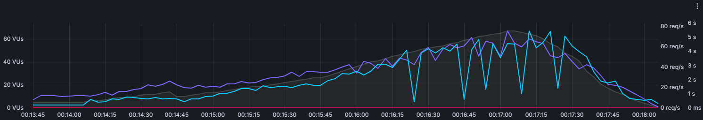
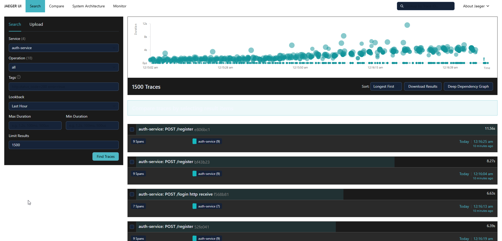
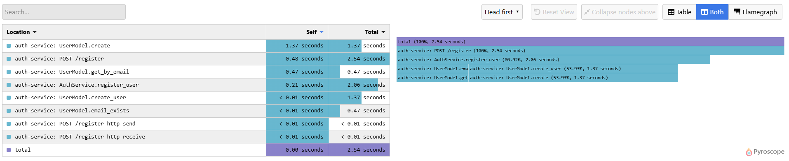
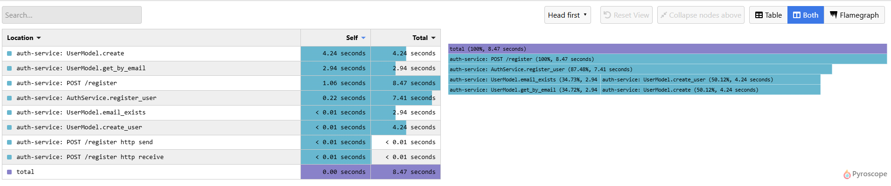
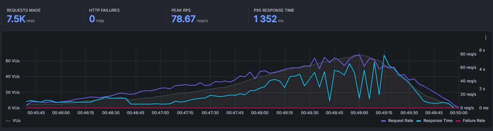
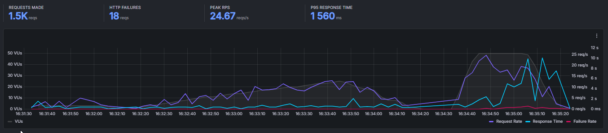

Based on the analysis provided, here are the key findings about the high response time issues:

## Performance Analysis Summary

### **1. PgBouncer Impact**
- **Before PgBouncer:** 
- **After PgBouncer:** 
- **Finding:** PgBouncer showed some drops in response time but **did not solve the core issue**.

### **2. Root Cause Identification**

- Some requests are taking **up to 12 seconds** to respond
- **Recommendation:** Focus on normal requests rather than longest outliers for accurate diagnosis

### **3. Service-Level Analysis**

**POST /register:**



**POST /login:**


**Critical Finding:** `AuthService` is taking **excessively long** to respond.

### **4. Testing Issues**

- **k6 Test Problem:** `/me` endpoints returning `401 Unauthorized` repeatedly
- **Root Cause:** One user logging out (blacklisting token) while another concurrent user tries to use that same token

### **5. Database Connection Errors**

**OrdersDB Error (before pooling):**
```
2025-12-28 16:41:35,563 - routes.order_routes - ERROR - Create order error: 
QueuePool limit of size 5 overflow 10 reached, connection timed out, timeout 30.00
```

**PaymentGRPCClient Error:**
```
otel.status_code: ERROR
otel.status_description: AioRpcError: <AioRpcError of RPC that terminated with:
    status = StatusCode.INTERNAL
    details = "This session is provisioning a new connection; concurrent operations are not permitted (Background on this error at: https://sqlalche.me/e/20/isce)"
    debug_error_string = "UNKNOWN:Error received from peer {grpc_message:"This session is provisioning a new connection; concurrent operations are not permitted (Background on this error at: https://sqlalche.me/e/20/isce)", grpc_status:13}"
>
service.name: PaymentGRPCClient
```

### **6. Key Issue: ISCE Error**
The **isce** error code indicates: **"This session is provisioning a new connection; concurrent operations are not permitted"**

**This occurs when:**
- Multiple async operations try to use the same database session simultaneously
- The session hasn't fully initialized its database connection yet
- SQLAlchemy prevents concurrent operations during this provisioning phase

## **Primary Conclusions:**
1. **AuthService is the main bottleneck** - causing most response time issues
2. **Database session management problems** - ISCE errors indicate improper async session handling
3. **Token management issues** in concurrent testing scenarios
4. **PgBouncer alone is insufficient** - architectural changes needed in service layer

## when did we succeed

after implementing cache and db pooling correctly, we actually reduced response time 
by a great number, but still under high load we could actually see that still some responses take a high amount of time to get response.

